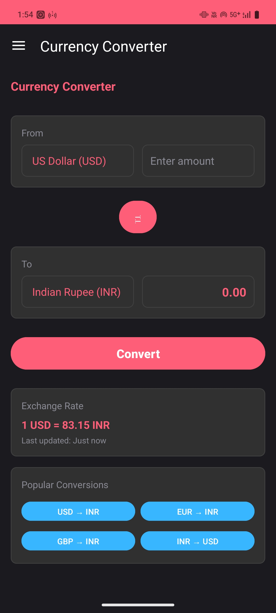
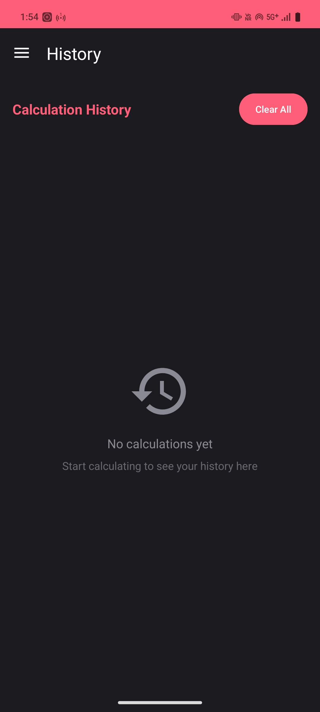
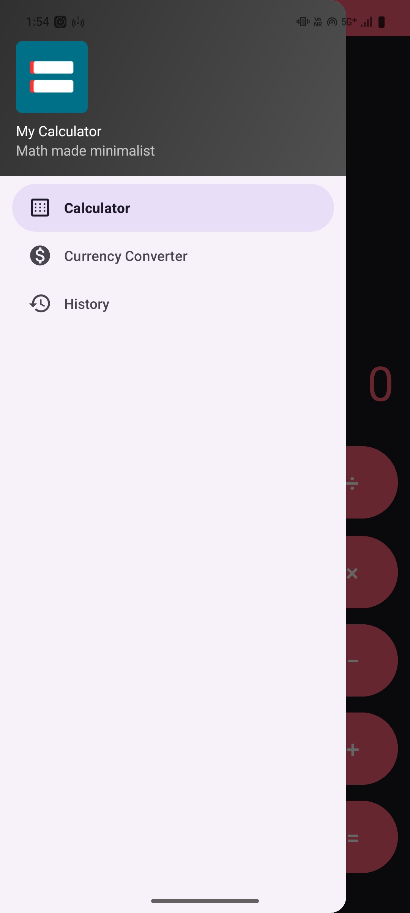

# My Calculator - Math Made Minimalist

<div align="center">
  
  <h3>Math Made Minimalist</h3>
</div>

[](https://developer.android.com/)
[](https://www.java.com/)
[](https://material.io/)

A modern, elegant Android calculator app with a clean dark theme and intuitive user interface. **Math Made Minimalist** - simplicity meets functionality.

## ✨ Features

### 🧮 Calculator
- **Basic Operations**: Addition, Subtraction, Multiplication, Division
- **Advanced Functions**: Percentage calculations, Plus/Minus toggle
- **Smart Input**: Automatic comma formatting for large numbers
- **Gesture Support**:
    - Swipe right to delete last digit
    - Double-tap to copy result to clipboard
- **Error Handling**: Division by zero protection
- **Responsive UI**: Smooth button animations and visual feedback

### 💱 Currency Converter
- **Multi-Currency Support**: USD, INR, EUR, GBP, JPY, AUD, CAD, CHF, CNY, SGD
- **Real-time Conversion**: Instant currency calculations
- **Quick Conversions**: One-tap popular currency pairs (USD↔INR, EUR→INR, GBP→INR)
- **Swap Feature**: Easy currency pair switching
- **Exchange Rate Display**: Current rate information with timestamps

### 📊 Calculation History
- **Persistent Storage**: All calculations saved locally
- **Timestamp Tracking**: Date and time for each calculation
- **Easy Management**: Clear individual or all history entries
- **Copy Results**: Tap any history item to copy result
- **Smart Limit**: Maintains last 100 calculations for optimal performance

### 🎨 User Interface
- **Dark Theme**: Eye-friendly dark mode design
- **Material Design**: Following Google's Material Design principles
- **Navigation Drawer**: Smooth side menu navigation
- **Dynamic Titles**: Context-aware page titles
- **Responsive Layout**: Optimized for different screen sizes

## 📱 Screenshots

<div align="center">
  
  
  
</div>

<div align="center">
  
</div>

> **Note**: Add your app screenshots to the `screenshots/` folder and update the filenames above

## 🚀 Getting Started

### Prerequisites
- Android Studio Arctic Fox or later
- Android SDK API level 24 or higher
- Java 11 or later

### Installation

1. **Clone the repository**
   ```bash
   git clone https://github.com/Abhibth0/My_Calculator.git
   cd MyCalculator
   ```

2. **Open in Android Studio**
    - Launch Android Studio
    - Select "Open an existing project"
    - Navigate to the cloned directory

3. **Build and Run**
    - Sync project with Gradle files
    - Connect your Android device or start an emulator
    - Click "Run" or press `Ctrl+R`

## 🛠️ Technical Details

### Architecture
- **Language**: Java
- **UI Framework**: Android Views with Material Design Components
- **Data Storage**: SharedPreferences with Gson for JSON serialization
- **Pattern**: Single Activity with multiple content views

### Key Technologies
- **Navigation**: DrawerLayout with NavigationView
- **Animations**: ObjectAnimator for smooth UI transitions
- **Gesture Recognition**: GestureDetector for swipe and tap gestures
- **Data Persistence**: SharedPreferences for local storage
- **JSON Handling**: Gson library for data serialization

### Project Structure
```
app/src/main/java/com/abhishek/mycalculator/
├── MainActivity.java          # Main activity with calculator logic
├── HistoryActivity.java       # History management (separate activity)
├── CurrencyConverterActivity.java # Currency conversion (separate activity)
├── CalculationHistory.java   # Data model for history entries
└── HistoryAdapter.java        # RecyclerView adapter for history list

app/src/main/res/
├── layout/                    # UI layouts
├── values/                    # Colors, strings, dimensions
├── drawable/                  # Icons and graphics
└── menu/                      # Navigation menu items
```

### Dependencies
- **AndroidX AppCompat**: Backward compatibility
- **Material Components**: Modern UI elements
- **RecyclerView**: Efficient list rendering
- **Gson**: JSON serialization for data storage

## 🎯 App Specifications

| Specification | Details |
|---------------|---------|
| **Min SDK** | API 24 (Android 7.0) |
| **Target SDK** | API 35 (Android 15) |
| **Version** | 1.0 |
| **Package** | com.abhishek.mycalculator |
| **Architecture** | MVVM-like with single activity |

## 🌟 Key Highlights

- **Zero Dependencies**: No external APIs required for core functionality
- **Offline First**: Works completely offline
- **Lightweight**: Minimal app size and memory footprint
- **Smooth Performance**: Optimized calculations and UI rendering
- **Data Persistence**: Automatic save/restore of calculation history
- **Error Resilient**: Comprehensive error handling and validation

## 🤝 Contributing

1. Fork the repository
2. Create your feature branch (`git checkout -b feature/AmazingFeature`)
3. Commit your changes (`git commit -m 'Add some AmazingFeature'`)
4. Push to the branch (`git push origin feature/AmazingFeature`)
5. Open a Pull Request

## 📝 Future Enhancements

- [ ] Scientific calculator mode
- [ ] Live currency exchange rates via API
- [ ] Export history to CSV/PDF
- [ ] Custom themes and color schemes
- [ ] Voice input for calculations
- [ ] Widget support for home screen
- [ ] Backup and sync across devices

## 📄 License

This project is licensed under the MIT License - see the [LICENSE](LICENSE) file for details.

## 👨‍💻 Developer

**Abhishek Patel**
- GitHub: [@Abhibth0](https://github.com/Abhibth0)
- Email: Abhishekpatelbth0@gmail.com

## 🙏 Acknowledgments

- Material Design guidelines by Google
- Android developer community
- Open source contributors

---

⭐ If you found this project helpful, please consider giving it a star!

**Made with ❤️ for Android users who love clean, functional design**
